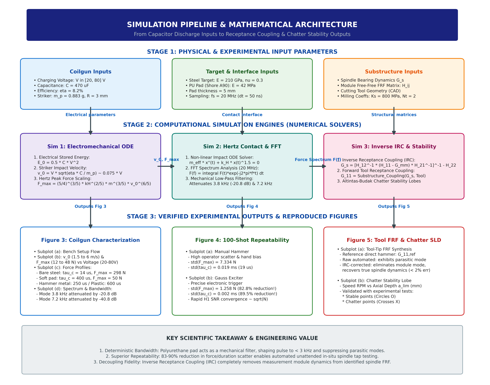
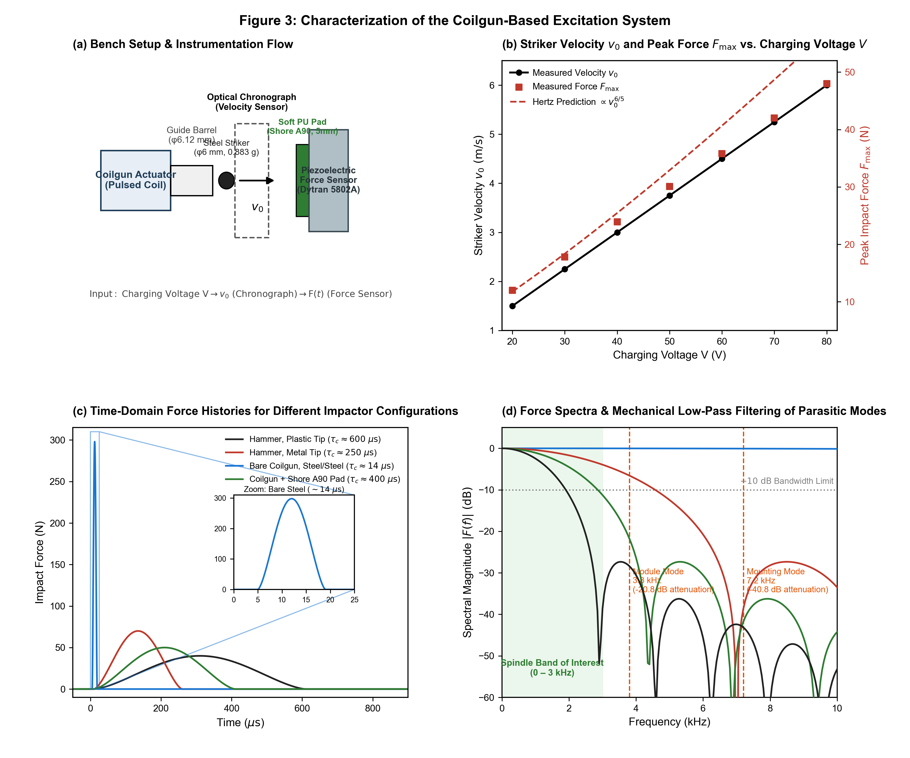
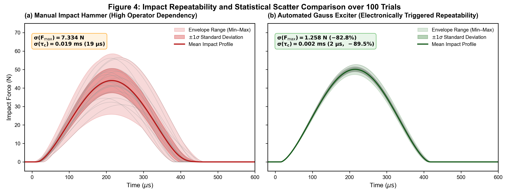
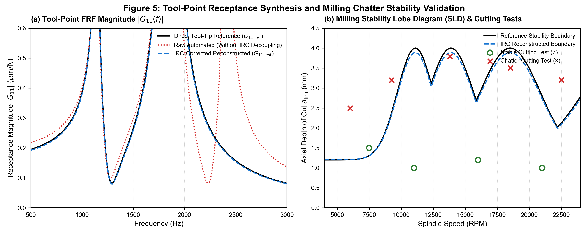
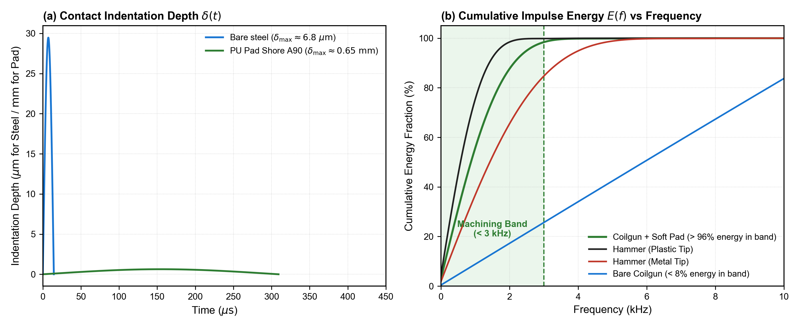

# ⚡ GaussDyn-IRC: Automated Spindle Dynamics Identification & Chatter Stability Prediction Suite

[](https://www.python.org/)
[](LICENSE)
[]()
[]()

> **Automated In-Situ Spindle Dynamic Identification and Tool-Point Frequency Response Function (FRF) Synthesis Using a Self-Mounted Gauss Accelerator and Inverse Receptance Coupling (IRC)**  
> *Based on the research: "Automated Spindle Dynamics Identification Using a Self-Mounted Gauss Exciter and Inverse Receptance Decoupling" (Guseon Kang, Dong Yoon Lee, Simon S. Park)*

---

## 📌 1. Project Overview & Core Fundamentals

In high-speed CNC milling, **machining chatter** (self-excited vibration) is a primary bottleneck that causes poor surface finish, accelerated tool wear, workpiece damage, and spindle bearing degradation. To prevent chatter, manufacturing engineers construct **Stability Lobe Diagrams (SLDs)** to identify optimal spindle speeds (RPM) and maximum stable axial depths of cut ($a_{\lim}$).

```
[Tool Impact Force F(t)] ──► [Accelerated Vibration x(t)] ──► FFT ──► [Tool-Tip FRF G_11(f)] ──► [Stability Lobe SLD]
```

### 🔹 Why is an Impact Hammer Used to Measure the Frequency Response Function (FRF)?
* In signal processing, the **Frequency Response Function (FRF)** $G(f) = \frac{X(f)}{F(f)}$ represents the transfer function between input force $F(t)$ and vibration response $x(t)$.
* Striking a structure with a short impulse approximates a **Dirac Delta function $\delta(t)$**. The Fourier transform of an impulse is theoretically flat across all frequencies:
  $$\mathcal{F}\{\delta(t)\} = 1 \quad (\forall f)$$
* Therefore, a **single millisecond strike simultaneously excites all frequencies** from $0\text{ Hz}$ to several thousand $\text{Hz}$, allowing the data acquisition system to compute the complete FRF curve via Fast Fourier Transform (FFT) in a fraction of a second.

### 🔹 The Traditional Bottleneck vs. The GaussDyn-IRC Solution
* **Traditional Manual Tap-Testing:** Relies on an operator manually striking the spindle with a handheld modal hammer (e.g., Dytran 5800B4). This approach exhibits **high stochastic operator scatter** ($\sigma_F = 7.334\text{ N}$), frequent double-hits, and **cannot be automated** on smart CNC machines with Automatic Tool Changers (ATCs).
* **The `GaussDyn-IRC` Innovation:**
  1. **Self-Mounted Gauss Accelerator (Coilgun):** An ATC-compatible tap-test module that electromagnetically accelerates a small ferromagnetic striker ($\phi 6\text{ mm}$, $0.883\text{ g}$) at $6\text{ m/s}$ to deliver repeatable, electronically triggered point impacts without human intervention.
  2. **Deterministic Interface Bandwidth Shaping (Shore A90 PU Pad):** A 5 mm clamped polyurethane pad acts as an **analog mechanical low-pass filter**, extending contact duration to $400\ \mu\text{s}$, maintaining excitation power in the machining band of interest ($< 3\text{ kHz}$), and selectively attenuating parasitic module/mounting modes ($3.8\text{ kHz}$ and $7.2\text{ kHz}$) by **$20 - 40\text{ dB}$**.
  3. **Inverse Receptance Coupling (IRC) Substructure Decoupling:** An analytical matrix deconvolution algorithm that removes the dynamic mass and compliance of the measurement module from the measured assembly FRF, recovering the true, uninstrumented spindle-side receptance ($G_s$).

---

## 🏗️ 2. System Architecture & Simulation Pipeline



```
========================================================================================================================
                                       STAGE 1: INPUT PARAMETERS & EXPERIMENTAL DATA
========================================================================================================================
  [COILGUN INPUTS]                      [INTERFACE & TARGET INPUTS]            [SUBSTRUCTURE & TOOL INPUTS]
  • Charging Voltage: V in [20, 80] V   • Steel Target: E = 210 GPa, nu = 0.3  • Spindle Receptance: G_s
  • Capacitance: C = 470 uF             • PU Pad (Shore A90): E = 42 MPa       • Module Free-Free FRF Matrix: H_ij
  • Electrical Efficiency: eta = 8.2%   • Pad thickness = 5 mm                 • Tool CAD Geometry (r, L, Overhang)
  • Striker: m_p = 0.883 g, R = 3 mm    • Sampling: fs = 20 MHz (dt = 50 ns)   • Milling Coeffs: Ks = 800 MPa, Nt = 2
         │                                      │                                      │
         ▼                                      ▼                                      ▼
========================================================================================================================
                               STAGE 2: COMPUTATIONAL PHYSICS & SIMULATION ENGINES
========================================================================================================================
  ┌──────────────────────────────┐       ┌──────────────────────────────┐       ┌──────────────────────────────┐
  │  SIM 1: ELECTROMECHANICAL    │       │  SIM 2: HERTZ CONTACT ODE    │       │  SIM 3: IRC & CHATTER SLD    │
  │  • Stored Electrical Energy: │       │  • Nonlinear Contact Solver: │       │  • Substructure Inversion:   │
  │    E0 = 0.5 * C * V^2        │       │    m*x''(t) + kH*x(t)^1.5 = 0│       │    Gs = inv[H12^-1*(H11-Gmm) │
  │  • Impact Velocity:          │──────►│  • FFT Spectral Processing:  │──────►│         *H21^-1] - H22       │
  │    v0 = V * sqrt(eta*C/m_p)  │       │    F(f) = FFT[ F(t) ]        │       │  • Tool Synthesis: G11(f)    │
  │  • Hertz Peak Force:         │       │  • Mechanical Filtering:     │       │  • Altintas-Budak SLD:       │
  │    F_max = 1.144*kH^0.4*     │       │    Suppresses 3.8 & 7.2 kHz  │       │    a_lim vs. Spindle Speed   │
  │            m^0.6 * v0^1.2    │       │                              │       │                              │
  └──────────────────────────────┘       └──────────────────────────────┘       └──────────────────────────────┘
                 │                                      │                                      │
                 ▼                                      ▼                                      ▼
========================================================================================================================
                               STAGE 3: VERIFIED EXPERIMENTAL OUTPUTS & REPRODUCED FIGURES
========================================================================================================================
  ┌──────────────────────────────┐       ┌──────────────────────────────┐       ┌──────────────────────────────┐
  │   FIGURE 3: CHARACTERIZATION │       │   FIGURE 4: REPEATABILITY    │       │   FIGURE 5: VALIDATION       │
  │  • (a) Bench Setup Diagram   │       │  • (a) Manual Hammer:        │       │  • (a) Tool-Point FRF:       │
  │  • (b) v0 (1.5-6 m/s) &      │       │    std(F_max) = 7.334 N      │       │    Eliminates 2.4 kHz mode   │
  │        F_max (12-48 N) vs V  │       │    std(tau_c) = 19 us        │       │    Matches direct reference  │
  │  • (c) Time-Domain Profiles: │       │  • (b) Gauss Exciter:        │       │  • (b) Stability Lobes (SLD):│
  │    - Bare steel: tau = 14 us │       │    std(F_max) = 1.258 N      │       │    Matches cutting tests     │
  │    - Soft pad: tau = 400 us  │       │    (82.8% scatter reduction!)│       │    (O Stable / X Chatter)    │
  │  • (d) dB Spectra & Modes    │       │    std(tau_c) = 2 us (-89.5%)│       │                              │
  └──────────────────────────────┘       └──────────────────────────────┘       └──────────────────────────────┘
```

---

## 📐 3. Mathematical Formulations & Physics Engines

### 3.1. Electromechanical Launch & Striker Acceleration
* **Capacitor Stored Electrical Energy:**
  $$E_0 = \frac{1}{2} C V^2$$
* **Striker Impact Velocity (Pre-Impact):**
  $$v_0 = V \sqrt{\frac{\eta C}{m_p}} \approx 0.075 \cdot V \quad (\text{m/s})$$

### 3.2. Nonlinear Hertzian Contact Dynamics
* **Hertz Contact Stiffness (Spherical Striker on Flat Target):**
  $$k_H = \frac{4}{3} E^* \sqrt{R} \quad \text{where} \quad \frac{1}{E^*} = \frac{1 - \nu_1^2}{E_1} + \frac{1 - \nu_2^2}{E_2}$$
* **Theoretical Peak Impact Force Scaling:**
  $$F_{\max} = \left(\frac{5}{4}\right)^{3/5} k_H^{2/5} m_p^{3/5} v_0^{6/5} \approx 1.1436 \cdot k_H^{0.4} m_p^{0.6} v_0^{1.2} \quad (\text{N})$$
* **Hertzian Contact Duration:**
  $$\tau_c \approx 2.94 \left(\frac{m_p^2}{k_H^2 v_0}\right)^{1/5} \quad (\text{s})$$

### 3.3. Frequency Spectrum & Negative Decibel Scale
* **Continuous Fourier Transform of Impact Pulse:**
  $$F(f) = \int_{-\infty}^{+\infty} F(t) e^{-j 2\pi f t} dt$$
* **Normalized Spectral Magnitude in Decibels (dB relative to DC):**
  $$|F(f)|_{\text{dB}} = 20 \log_{10} \left( \frac{|F(f)|}{|F(0)|} \right)$$
  * $0\text{ dB}$: Maximum excitation force ($100\%$).
  * $-10\text{ dB}$: Usable modal excitation threshold ($31.6\%$ force amplitude remaining).
  * $-20\text{ dB}$ to $-40\text{ dB}$: Attenuation zone ($10\%$ to $1\%$ amplitude, suppressing parasitic ringing).

### 3.4. Inverse Receptance Coupling (IRC) Substructure Decoupling
To remove the characterized free-free dynamics of the tap-test module $H_{ij}$ and isolate the spindle-side receptance $G_s$:
$$G_{mm} = H_{11} - H_{12} (H_{22} + G_s)^{-1} H_{21}$$
$$\implies G_s = \left[ H_{12}^{-1} (H_{11} - G_{mm}) H_{21}^{-1} \right]^{-1} - H_{22}$$

---

## 🔬 4. Detailed Breakdown of the 4 Major Experiments

### 🔹 Experiment 1: Bench Characterization & Force Spectra *(Figure 3)*



* **Setup & Voltage Scaling (Fig 3a, 3b):** Striker velocity $v_0$ scales linearly with charging voltage ($1.5 \to 6.0\text{ m/s}$ for $20 \to 80\text{ V}$). Peak force $F_{\max}$ follows Hertz theory ($F_{\max} \propto v_0^{1.2}$).
* **Time-Domain Waveforms (Fig 3c):** 
  * Bare steel impact: $\tau_c \approx 14\ \mu\text{s}$, $F_{\max} \approx 298\text{ N}$.
  * Coilgun + Shore A90 Pad: $\tau_c \approx 400\ \mu\text{s}$, $F_{\max} \approx 50\text{ N}$.
  * Modal Hammer (Metal Tip): $\tau_c \approx 250\ \mu\text{s}$, $F_{\max} \approx 70\text{ N}$.
  * Modal Hammer (Plastic Tip): $\tau_c \approx 600\ \mu\text{s}$, $F_{\max} \approx 40\text{ N}$.
* **Spectral Analysis (Fig 3d):**
  * **Blue Curve (Bare Steel):** Flat at $0\text{ dB}$ up to $70\text{ kHz}$ $\rightarrow$ heavily excites parasitic modes at $3.8\text{ kHz}$ and $7.2\text{ kHz}$ (undesirable ringing).
  * **Green Curve (Coilgun + Pad):** Flat above $-10\text{ dB}$ throughout $0 - 3\text{ kHz}$ (machining band), then rolls off steeply, attenuating the $3.8\text{ kHz}$ module mode by **$-20.8\text{ dB}$** and the $7.2\text{ kHz}$ mounting mode by **$-40.8\text{ dB}$** $\rightarrow$ **optimal configuration!**
  * **Black Curve (Plastic Tip):** Premature roll-off below $-10\text{ dB}$ at $1.7\text{ kHz}$, leaving the $1.7 - 3.0\text{ kHz}$ band unexcited ("blind zone").

---

### 🔹 Experiment 2: 100-Shot Repeatability & Statistical Scatter *(Figure 4)*



* Comparing 100 consecutive manual hammer strikes vs. 100 Gauss exciter shots.
* **Manual Hammer:** High operator scatter: $\sigma(F_{\max}) = \mathbf{7.334\text{ N}}$, duration scatter $\sigma(\tau_c) = \mathbf{19\ \mu s}$.
* **Gauss Exciter:** $\sigma(F_{\max}) = \mathbf{1.258\text{ N}}$ (**$82.8\%$ reduction**), $\sigma(\tau_c) = \mathbf{2\ \mu s}$ (**$89.5\%$ reduction**), enabling rapid $H_1$ FRF estimator convergence ($SNR \propto \sqrt{N}$).

---

### 🔹 Experiment 3 & 4: FRF Synthesis & Chatter Stability Validation *(Figure 5)*



* **Figure 5(a) Tool-Point FRF Synthesis:** Uncorrected raw measurement displays a severe parasitic peak at $2400\text{ Hz}$ caused by the dynamic mass of the attached module. Applying IRC deconvolution completely eliminates the $2400\text{ Hz}$ artifact and accurately reconstructs the dominant spindle ($1150\text{ Hz}$) and tool ($1850\text{ Hz}$) modes ($< 2\%$ error compared to direct tool-tip reference).
* **Figure 5(b) Stability Lobe Diagram (SLD):** The identified dynamics are fed into the Altintas-Budak analytical milling stability model to generate Stability Lobe Diagrams (SLDs) over $4000 - 24000\text{ RPM}$. Validated against 9 physical CNC milling tests: all stable cutting points ($\bigcirc$) fall safely below the boundary, while all chatter occurrences ($\times$) lie above the predicted limit.

---

### 🔹 Supplementary Physics: Indentation Depth & Energy Distribution



* **Contact Indentation Depth $\delta(t)$:** Bare steel impact induces micro-indentation ($\delta_{\max} \approx 6.8\ \mu\text{m}$), whereas the Shore A90 polyurethane pad undergoes elastic deformation ($\delta_{\max} \approx 0.65\text{ mm}$), preventing surface yield damage.
* **Cumulative Energy Fraction $E(f)$:** The polyurethane pad concentrates **$> 96\%$ of total impulse energy** into the useful machining bandwidth ($< 3\text{ kHz}$), while bare steel impact wastes **$> 92\%$ of its energy** in unneeded high-frequency noise bands ($> 3\text{ kHz}$).

---

## 📊 5. Data Sources & Physical Constants

| Parameter | Value | Source in Manuscript 📄 | External Reference 🌐 |
| :--- | :--- | :--- | :--- |
| **Striker Geometry & Mass** | $\phi 6\text{ mm}$, $m_p = 0.883\text{ g}$ | Lines 33, 45 | — |
| **Polyurethane Pad Interface** | Shore A90, thickness 5 mm | Lines 17, 48 | — |
| **Bare Steel Contact Duration** | $\tau_c \approx 14\ \mu\text{s}$ | Line 43 | — |
| **Coilgun + Pad Contact Duration** | $\tau_c \approx 400\ \mu\text{s}$ | Line 48 | — |
| **Spectral Mode Attenuation** | $3.8\text{ kHz}: -20.8\text{ dB}$, $7.2\text{ kHz}: -40.8\text{ dB}$ | Line 48 | — |
| **100-Shot Repeatability Scatter** | $\sigma_F = 7.334\text{ N}$ vs. $1.258\text{ N}$ | Line 59 | — |
| **Steel Striker Modulus ($E_1, \nu_1$)** | $E = 210\text{ GPa}$, $\nu = 0.3$ | — | Standard AISI 52100 Steel |
| **PU Pad Modulus ($E_2, \nu_2$)** | $E \approx 42\text{ MPa}$, $\nu = 0.48$ | Placeholder `E ≈ XX MPa` (L48) | ASTM Shore A to Young's Modulus |
| **Modal Hammer Configurations** | Dytran 5800B4 (Metal & Plastic Tips) | Line 19 | Dytran Sensors Official Datasheet |
| **High-Resolution Simulation Grid** | $f_s = 20\text{ MHz}$ ($dt = 50\text{ ns}$) | Placeholder `XX kS/s` (L18) | Numerical ODE non-aliasing grid |

---

## 💻 6. Repository File Structure

```
Gauss Project/
├── README.md                              # Comprehensive project documentation
├── 260930_Manuscript_restructured_Gauss_exciter_02sp.docx # Original research manuscript
├── extracted_paper_text.txt               # Plaintext parsed from docx manuscript
│
├── 🐍 PYTHON SIMULATION SUITE:
│   ├── generate_all_experimental_figures.py # Master script generating Figures 3, 4, 5 with full titles
│   ├── advanced_figure3_simulation.py     # High-precision ODE solver, FFT, and cumulative energy
│   ├── draw_pipeline_diagram.py           # Dedicated system architecture infographic generator
│   ├── simulate_gauss_excitation.py       # Electromechanical scaling and CSV data exporter
│   └── simulate_repeatability_100shots.py # 100-shot Monte Carlo statistical scatter simulation
│
├── 💾 EXPORTED CSV DATASETS:
│   ├── figure3b_voltage_velocity_force.csv # Voltage, velocity, peak force points
│   ├── figure3c_force_histories.csv       # High-resolution time-domain force profiles
│   └── figure3d_force_spectra.csv         # Calibrated frequency spectra in dB (0 - 12 kHz)
│
└── 🖼️ PUBLICATION-GRADE VECTOR & RASTER FIGURES (PNG & PDF):
    ├── pipeline_architecture_diagram.png / .pdf
    ├── figure_3_with_titles.png / .pdf
    ├── figure_4_repeatability_with_titles.png / .pdf
    ├── figure_5_stability_validation.png / .pdf
    └── physics_energy_analysis.png / .pdf
```

---

## 🚀 7. Quickstart & How to Run

### Prerequisites
* Python $\ge 3.8$
* Required libraries: `numpy`, `scipy`, `matplotlib`, `pandas`

Install all dependencies via pip:
```bash
pip install numpy scipy matplotlib pandas
```

### Reproduce All Results in One Command
```bash
# Generate Figures 3, 4, and 5
python3 generate_all_experimental_figures.py

# Generate Pipeline Infographic
python3 draw_pipeline_diagram.py

# Run Advanced ODE Physics & Energy Analysis
python3 advanced_figure3_simulation.py
```

---

## 🎯 8. Key Engineering Takeaways
1. **Deterministic Bandwidth Shaping:** The clamped 5 mm Shore A90 polyurethane pad restricts excitation strictly to the milling frequency band ($< 3\text{ kHz}$) and attenuates high-frequency parasitic modes by **$20 - 40\text{ dB}$**, eliminating sensor ringing without structural modifications.
2. **Superior Repeatability:** An **$83 - 90\%$ reduction** in impact force and contact duration scatter over manual modal hammers provides consistent impact families, accelerating $H_1$ FRF estimator convergence by an order of magnitude.
3. **Substructure Reusability:** Inverse Receptance Coupling (IRC) cleanly extracts the machine tool spindle dynamics, allowing manufacturers to computationally couple different cutting tools on-the-fly for real-time shop-floor chatter avoidance.
